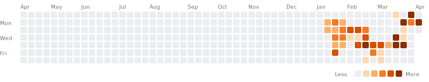

# Claude Token Usage



```
sequenceDiagram
    autonumber
    participant C as 고객폰
    participant Q as QR서버
    participant M as MONO서버
    participant O as 점주폰

    rect rgba(200,230,255,0.3)
    Note over C,Q: Phase 1 · QR 생성 (고객 요청)
    C->>Q: POST /api/qr (QrController.java:29)
    Note over Q: QR Redis SETEX QrToken TTL=10s<br/>(QrTokenService.java:28, 34-63)
    Q-->>C: 201 { tokenId }
    Note right of Q: ⏱ T1 · QR TTL 10s
    end

    rect rgba(220,255,220,0.3)
    Note over O,Q: Phase 2 · 점주 스캔 → 세션 발급
    O->>Q: POST /api/qr/{tokenId}/scan (QrController.java:63)
    Note over Q: QR Redis GET QrToken (line 103-108)<br/>QR Redis DEL QrToken (line 111, 재사용 금지)<br/>QR Redis SETEX ScanSession TTL=180s (line 29, 115-130)
    Q-->>O: 200 { sessionToken }
    Note right of Q: ⏱ T2 · Session TTL 180s
    end

    rect rgba(255,240,200,0.3)
    Note over O,Q: Phase 3 · 결제 의도(Intent) 생성
    O->>Q: POST /cpqr/{sessionToken}/initiate<br/>Idempotency-Key: UUID (PaymentIntentController.java:32)
    Note over Q: 멱등키 게이트 · body SHA-256<br/>(PaymentIntentService.java:100-139)
    Note over Q: QR Redis 세션 검증 (line 141-149)
    Q->>M: GET /internal/menus/... (MenuClient, line 154-171)
    Note right of Q: ⏱ T3 · restTemplate 3s/5s ×3, CB default 50%
    M-->>Q: 200 menus
    Note over Q: QR MySQL INSERT PaymentIntent(PENDING)<br/>+ PaymentIntentItem 스냅샷 (line 184-213)
    Q->>M: POST /internal/notifications/send (고객 알림, line 220-238)
    M-->>Q: 200
    Q-->>O: 201 { intentId, expiresAt = now+3m }
    Note right of Q: ⏱ T4 · Intent expiresAt = 180s
    end

    rect rgba(255,220,220,0.3)
    Note over C,M: Phase 4 · 고객 승인 · 자금 캡처 (핵심)
    C->>Q: POST /payments/{intentId}/approve<br/>PIN + Idempotency-Key (PaymentApprovalController.java:28)
    Note over Q: 멱등키 게이트 + Intent 상태/만료/소유자 검증<br/>(PaymentIntentService.java:278-329)
    Q->>M: POST /internal/customers/{id}/pin-verify (line 331-335)
    Note right of Q: ⏱ T5 · restTemplate 3s/5s ×3, CB default
    M-->>Q: 200 OK
    Q->>M: POST /internal/wallets/{wid}/stores/{sid}/capture<br/>Idempotency-Key = UUID("capture:"+publicId)<br/>(FundsService.java:44-99, WalletClient.java:92-113)
    Note right of Q: ⏱ T6 · writeRestTemplate 2s/3s ×1<br/>CB strict 40% · Fail-Fast
    Note over M: MONO DB SELECT ... FOR UPDATE<br/>PESSIMISTIC_WRITE lock_timeout=3000ms<br/>(WalletStoreBalanceRepository.java:40-48)
    Note right of M: ⏱ T7 · 락 대기 3s 초과 → 409 + Retry-After:2
    Note over M: MONO DB UPDATE balance -= amount<br/>INSERT Transaction + TransactionItem<br/>(InternalWalletService.java:197-247)
    M-->>Q: 200 FundsResponse { approved }
    Note over Q: QR MySQL markApproved(now)<br/>@Version 낙관락 (PaymentIntent.java:34, 108-119)
    Q->>M: POST /internal/notifications/send × 2<br/>(점주·고객, PaymentIntentService.java:376-390)
    Note right of Q: ⏱ T8 · CB lenient 70% · 실패해도 본 경로 영향 없음
    M-->>Q: 200
    Q-->>C: 200 OK · 결제 완료
    end

    rect rgba(230,220,255,0.3)
    Note over O,M: Phase 5 · 점주 폰 알림 수신 (배경 채널)
    O->>M: GET /api/notifications/subscribe/owner/{ownerId}<br/>text/event-stream (NotificationController.java:62-74)
    Note over M: SseEmitter timeout=60min<br/>(NotificationService.java:42, 57-105)
    Note over M: MONO DB INSERT Notification (REQUIRES_NEW)<br/>(NotificationService.java:114-148)
    M-->>O: SSE push (연결 활성) · 또는 FCM (비활성)
    Note right of M: ⏱ T9 · SSE 60min
    end
```
